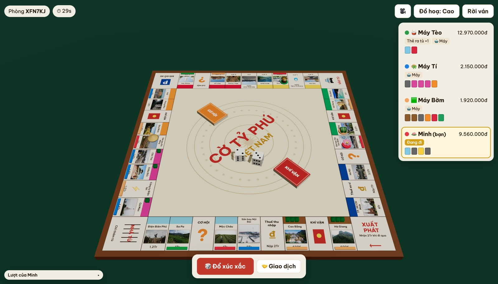
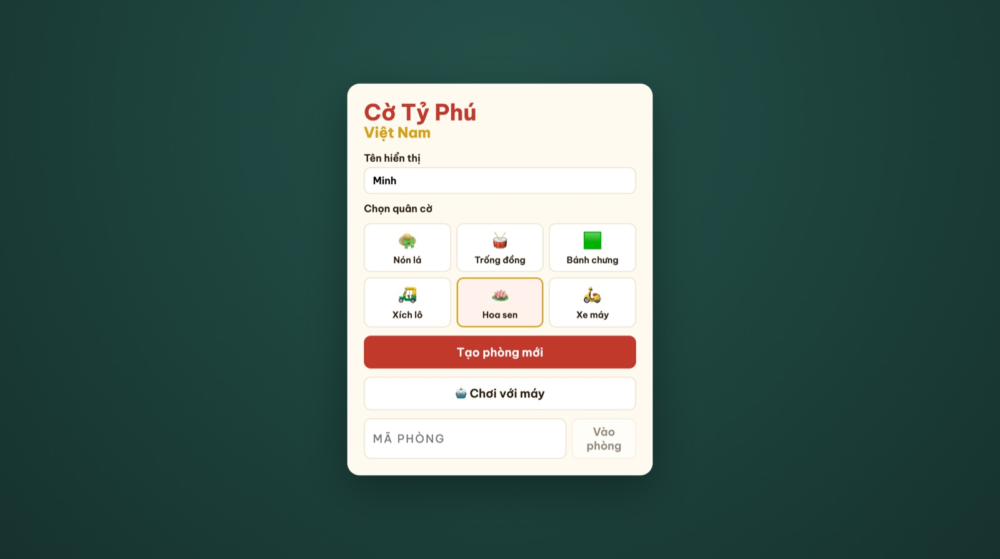
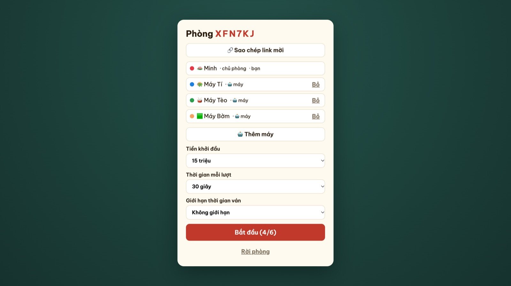
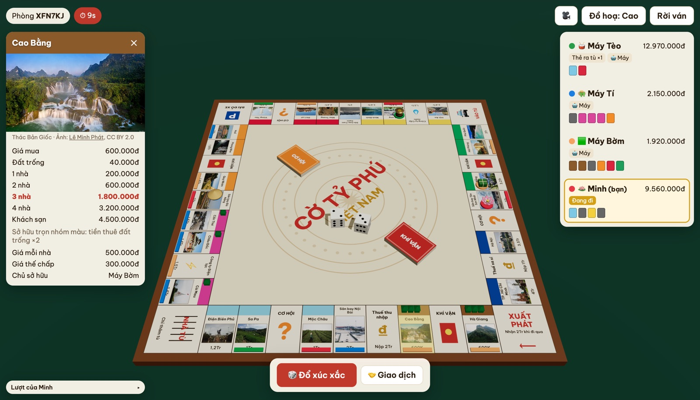
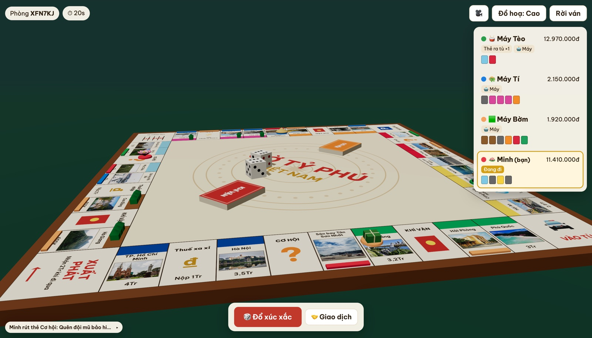
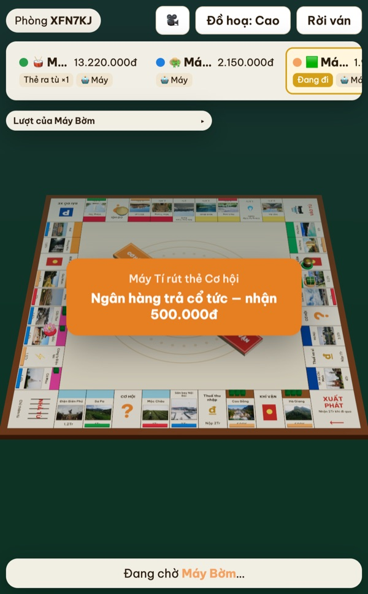

# Cờ Tỷ Phú Việt Nam 🇻🇳

> Vietnamese-themed 3D Monopoly — play online with friends or against the computer, right in the browser.

Cờ tỷ phú phiên bản Việt Nam: bàn cờ 3D với địa danh từ Hà Giang tới Cà Mau, tiền VNĐ, thẻ Cơ hội / Khí vận đậm chất đời thường. Chơi online cùng bạn bè hoặc đấu với máy, ngay trên trình duyệt.

**▶ Chơi ngay: [monopoly-vn.vercel.app](https://monopoly-vn.vercel.app)**

## Có gì trong game

- 🏯 **Địa danh Việt Nam thật** trên từng ô: Chùa Một Cột, Tháp Rùa, Chùa Cầu, Cầu Vàng, thác Bản Giốc, vịnh Hạ Long, Nhà thờ Đức Bà…
- 🎲 **Bàn cờ 3D**: xoay, zoom, xúc xắc lăn thật, quân cờ nhảy từng ô, nhà và khách sạn mọc lên khi xây.
- 👒 **Quân cờ Việt**: nón lá, trống đồng, bánh chưng, xích lô, hoa sen, xe máy.
- 🧧 **Thẻ Cơ hội / Khí vận "troll"**: lì xì Tết, phạt nguội, sinh nhật bồ nhí, lộ chuyện có con riêng, mẹ vợ lên chơi, khoe trúng số bị cả làng đòi khao…
- 👥 **Chơi online 2–6 người**: tạo phòng, gửi link hoặc mã 6 ký tự cho bạn bè; rớt mạng vẫn vào lại được.
- 🤖 **Chơi với máy**: một nút là có ngay 3 đối thủ biết mua đất, xây nhà, thế chấp và giao dịch.
- 📜 **Đủ luật cờ tỷ phú**: mua đất, thu tiền thuê, xây nhà, thế chấp, vào tù, giao dịch, phá sản, giới hạn thời gian ván.

## Hình ảnh

| Trang chủ | Phòng chờ với máy |
|---|---|
|  |  |

| Chi tiết ô đất kèm ảnh địa danh | Cận cảnh bàn cờ 3D |
|---|---|
|  |  |

   
  <em>Chơi trên điện thoại</em>

---

Ảnh địa danh: Wikimedia Commons (CC0, public domain, CC BY, CC BY-SA). Tác giả và giấy phép từng ảnh hiển thị trong game khi bấm vào ô, và trong <a href="apps/client/src/landmarks.json">landmarks.json</a>.
